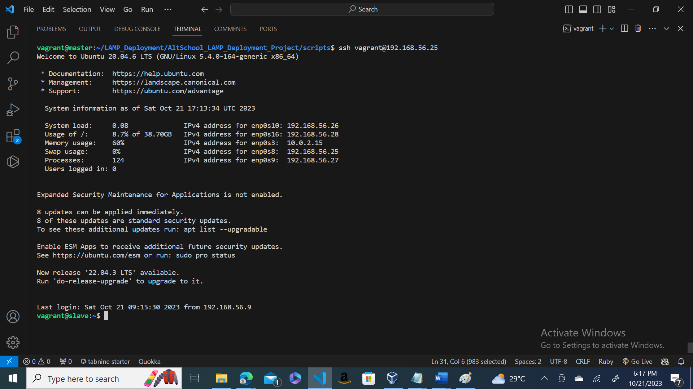

# LAMP Deployment with Vagrant and Ansible

A project to automate the deployment of a LAMP stack using Vagrant and Ansible.

## Setup

- Clone this repository.
- Run `vagrant up` to set up the VMs.
- ...

## Ansible Playbooks

### Playbook 1: Deploy LAMP Stack
- Description of the playbook.
- Screenshots.

### Playbook 2: Create Cron Job
- Description of the playbook.
- Screenshots.

## Application Accessibility

- Proof of the application's accessibility.
- Screenshots of the deployed web app.

